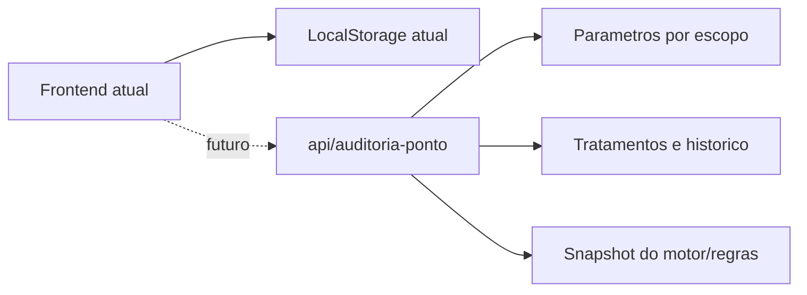

# Auditoria de Ponto - Proposta de Contratos API v1

Data: 2026-06-13

## Objetivo

Definir contratos de API para persistir e consultar a auditoria de ponto sem interferir no trabalho paralelo do backend.

Esta entrega e uma proposta isolada. Ela nao altera autenticacao, nao cria infraestrutura, nao exige migrations e nao muda endpoints ja existentes.

## Como nao atrapalhar o backend

1. Manter os arquivos como proposta ate o backend validar nomes, rotas e modelos.
2. Usar namespace e rotas isoladas: `api/auditoria-ponto`.
3. Nao reutilizar tabelas ou entidades existentes sem revisao do backend.
4. Nao implementar regra de negocio nos stubs.
5. Nao acoplar o frontend imediatamente aos endpoints novos.
6. Backend pode copiar os records para o projeto real quando concordar com o contrato.
7. Qualquer mudanca deve ser versionada como `v2`, sem quebrar `v1`.

## Arquivos gerados

- `backendApi/Contracts/AuditoriaPontoContracts.cs`
- `backendApi/Controllers/AuditoriaPontoController.cs`
- `src/api/auditoriaPontoApi.js`
- `src/api/apiRoutes.js`
- `src/api/index.js`

O cliente frontend foi criado apenas como ponto de integracao futuro. Ele ainda nao e usado pelas telas, portanto o backend pode revisar o contrato sem quebrar a aplicacao em uso.

## Fluxo recomendado



## Endpoints propostos

### GET `/api/auditoria-ponto/resumo`

Consulta resumo executivo da auditoria.

Query:

```json
{
  "de": "2026-05-28",
  "ate": "2026-06-03",
  "filialId": 1,
  "deptoId": 10,
  "status": "pendente",
  "severidade": "critica"
}
```

Response:

```json
{
  "totalAnomalias": 442,
  "criticas": 154,
  "altas": 223,
  "medias": 0,
  "baixas": 0,
  "pendentes": 442,
  "emAnalise": 0,
  "justificadas": 0,
  "ajustesFolha": 0,
  "resolvidas": 0,
  "ignoradas": 0,
  "percentualTratado": 0,
  "maiorRisco": {},
  "departamentosCriticos": [],
  "colaboradoresCriticos": [],
  "regrasCriticas": [],
  "impactoFinanceiro": {}
}
```

### GET `/api/auditoria-ponto/anomalias`

Lista paginada de anomalias.

Query:

```json
{
  "de": "2026-05-28",
  "ate": "2026-06-03",
  "filialId": 1,
  "deptoId": 10,
  "matricula": "5986",
  "colaborador": "MARCELO",
  "regra": "EVENTO_SEM_MARCACAO",
  "severidade": "critica",
  "status": "pendente",
  "somentePendentesCriticas": true,
  "page": 1,
  "pageSize": 100
}
```

Response: `PagedResponse<AuditoriaPontoAnomaliaDto>`.

### GET `/api/auditoria-ponto/anomalias/{anomaliaId}/memoria`

Consulta memoria de calculo completa da anomalia.

Response inclui:

- versao do motor
- hash das regras
- status de fechamento
- status da jornada
- parametros snapshot
- regras acionadas
- horarios previstos
- marcacoes usadas

### POST `/api/auditoria-ponto/tratamentos`

Salva tratamento da anomalia.

Payload:

```json
{
  "anomaliaId": "string",
  "status": "justificado",
  "justificativa": "Validado com gestor.",
  "responsavel": "usuario@empresa.com",
  "origem": "frontend"
}
```

### GET `/api/auditoria-ponto/tratamentos/{anomaliaId}/historico`

Consulta trilha de tratamento.

### GET `/api/auditoria-ponto/parametros`

Consulta parametros vigentes por escopo.

Query:

```json
{
  "clienteId": 1,
  "filialId": 1,
  "deptoId": 10,
  "cctId": "string"
}
```

### PUT `/api/auditoria-ponto/parametros`

Salva parametros por escopo.

Parametros atuais do motor:

- `toleranciaMinutos`
- `toleranciaDuplicidadeMinutos`
- `janelaPareamentoMaxMinutos`
- `intervaloIntrajornadaMinutos`
- `jornadaIntrajornadaMinutos`
- `intervaloInterjornadaMinutos`
- `pontoBritanicoDias`
- `minutosResiduaisMinutos`
- `limiteHoraExtraDiariaMinutos`
- `intervaloIntrajornadaMaxMinutos`
- `diasConsecutivosLimite`
- `limiteBancoHorasPositivoMinutos`
- `limiteBancoHorasNegativoMinutos`
- `recorrenciaRiscoLimite`

### POST `/api/auditoria-ponto/reprocessamentos`

Solicita reprocessamento de auditoria.

Payload:

```json
{
  "de": "2026-05-28",
  "ate": "2026-06-03",
  "filialId": 1,
  "deptoId": 10,
  "preservarTratamentos": true,
  "responsavel": "usuario@empresa.com"
}
```

## Status propostos

- `pendente`
- `em_analise`
- `justificado`
- `ajuste_folha`
- `resolvido`
- `ignorado`

## Severidades propostas

- `critica`
- `alta`
- `media`
- `baixa`
- `ok`

## Pontos para validar com backend

1. Se `anomaliaId` sera deterministico pelo frontend/motor ou gerado no banco.
2. Se parametros devem ser por cliente, filial, departamento, CCT ou combinacao.
3. Se reprocessamento sera sincrono ou job assíncrono.
4. Se impacto financeiro sera calculado no backend ou apenas persistido.
5. Se o backend vai armazenar snapshot completo das regras para auditoria posterior.
6. Se status `ajuste_folha` deve gerar integracao com fechamento/folha.
